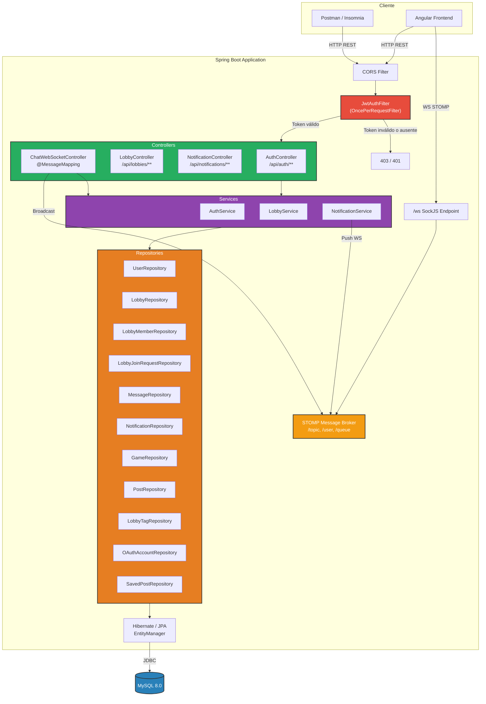
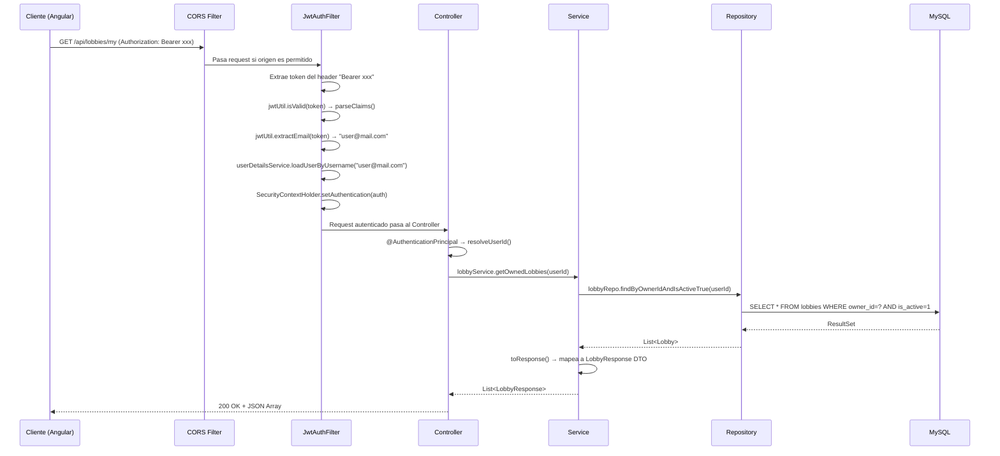

# 1. Visión General y Arquitectura

## 1.1 ¿Qué es SquadUp?

**SquadUp** es una plataforma social diseñada exclusivamente para jugadores de videojuegos (gamers). Su objetivo es proporcionar un ecosistema donde los jugadores puedan:

- **Crear y descubrir Lobbies** — salas de juego organizadas por título, rango competitivo o tipo de partida (casual, competitiva, rankeada).
- **Comunicarse en tiempo real** — chat grupal dentro de cada Lobby e intercambio de mensajes directos (DM) entre usuarios, todo mediante WebSockets.
- **Publicar contenido** — sistema de posts con soporte multimedia (imágenes, GIFs) dentro de los Lobbies.
- **Recibir notificaciones instantáneas** — alertas push en tiempo real cuando alguien solicita unirse, te aceptan, te mencionan, o envían una imagen.

---

## 1.2 Stack Tecnológico

| Capa                  | Tecnología                                   | Versión     |
|-----------------------|----------------------------------------------|-------------|
| Lenguaje              | Java (LTS)                                   | 17          |
| Framework principal   | Spring Boot                                  | 3.2.4       |
| Seguridad             | Spring Security + JWT (jjwt)                 | 6.x / 0.12.5|
| OAuth2                | Spring OAuth2 Client (Google, Discord)       | 6.x         |
| ORM                   | Spring Data JPA + Hibernate ORM              | 6.4.4       |
| Base de Datos         | MySQL                                        | 8.0+        |
| Tiempo Real           | Spring WebSocket + STOMP                     | 6.x         |
| Tipos JSON nativos    | hypersistence-utils-hibernate-63             | 3.7.3       |
| Validación            | Jakarta Bean Validation (Hibernate Validator)| 3.0         |
| Mapeo DTO             | MapStruct                                    | 1.5.5       |
| Boilerplate           | Lombok                                       | (managed)   |
| Build tool            | Apache Maven                                 | 3.x         |
| Test                  | JUnit 5, Spring Security Test, H2 (in-memory)| —          |

---

## 1.3 Arquitectura de Capas

El proyecto implementa una arquitectura **MVC por capas** con inyección de dependencias (IoC) de Spring. Cada capa tiene una responsabilidad única y bien definida:



---

## 1.4 Estructura de Paquetes

```
com.squadup
├── SquadUpApplication.java          ← Punto de entrada (@SpringBootApplication)
│
├── config/
│   ├── SecurityConfig.java          ← Cadena de filtros, CORS, BCrypt, rutas públicas
│   └── WebSocketConfig.java         ← Broker STOMP, endpoints /ws, prefijos /app
│
├── controller/
│   ├── AuthController.java          ← POST /api/auth/register, /login
│   ├── LobbyController.java        ← CRUD Lobbies, join, leave, review requests
│   ├── NotificationController.java  ← GET notificaciones, unread-count, read-all
│   └── ChatWebSocketController.java ← @MessageMapping lobby chat + DMs
│
├── service/
│   ├── AuthService.java             ← Registro, login, generación JWT
│   ├── LobbyService.java           ← Lógica de negocio de lobbies
│   └── NotificationService.java     ← Persistencia + push WebSocket de notificaciones
│
├── repository/                      ← 11 interfaces JpaRepository
│   ├── UserRepository.java
│   ├── LobbyRepository.java
│   ├── LobbyMemberRepository.java
│   ├── LobbyJoinRequestRepository.java
│   ├── LobbyTagRepository.java
│   ├── MessageRepository.java
│   ├── NotificationRepository.java
│   ├── GameRepository.java
│   ├── PostRepository.java
│   ├── SavedPostRepository.java
│   └── OAuthAccountRepository.java
│
├── entity/                          ← 13 entidades JPA (@Entity)
│   ├── User.java
│   ├── Game.java
│   ├── UserGame.java
│   ├── Lobby.java
│   ├── LobbyMember.java
│   ├── LobbyJoinRequest.java
│   ├── LobbyTag.java
│   ├── Message.java
│   ├── Notification.java
│   ├── Post.java
│   ├── PostMedia.java
│   ├── SavedPost.java
│   ├── OAuthAccount.java
│   └── enums/                       ← 9 enumeraciones de dominio
│       ├── UserStatus.java          (ACTIVE, BANNED, INACTIVE)
│       ├── LobbyType.java          (COMPETITIVE, CASUAL, RANKED)
│       ├── LobbyPrivacy.java       (PUBLIC, PRIVATE)
│       ├── MemberRole.java         (OWNER, ADMIN, MEMBER)
│       ├── JoinRequestStatus.java  (PENDING, ACCEPTED, REJECTED)
│       ├── MessageType.java        (TEXT, IMAGE, GIF, SYSTEM)
│       ├── MessageStatus.java      (SENT, DELIVERED, READ, DELETED)
│       ├── NotificationType.java   (JOIN_REQUEST, REQUEST_ACCEPTED, ...)
│       └── OAuthProvider.java      (GOOGLE, DISCORD)
│
├── dto/                             ← 7 Data Transfer Objects
│   ├── RegisterRequest.java         ← Validaciones: fullName, username, email, password, confirmPassword
│   ├── LoginRequest.java            ← email + password
│   ├── AuthResponse.java           ← token, tokenType, userId, username, email, avatarUrl
│   ├── LobbyRequest.java           ← name, description, gameId, lobbyType, privacy, maxMembers, tags
│   ├── LobbyResponse.java          ← Lobby serializado con memberCount, tags, gameName, ownerUsername
│   ├── NotificationResponse.java   ← id, type, actorUsername, payload, read, createdAt
│   └── PostResponse.java           ← Respuesta serializada de posts
│
├── exception/                       ← Manejo global de errores
│   ├── GlobalExceptionHandler.java  ← @RestControllerAdvice con ErrorResponse record
│   ├── BadRequestException.java     ← → HTTP 400
│   ├── ForbiddenException.java      ← → HTTP 403
│   └── ResourceNotFoundException.java ← → HTTP 404
│
└── security/
    ├── JwtUtil.java                 ← Generación/validación con jjwt 0.12.x (HMAC-SHA)
    ├── JwtAuthFilter.java           ← OncePerRequestFilter: extrae Bearer token del header
    └── UserDetailsServiceImpl.java  ← Carga usuario por email desde MySQL
```

---

## 1.5 Patrones de Diseño Aplicados

| Patrón                    | Dónde se aplica                                                     |
|---------------------------|---------------------------------------------------------------------|
| **MVC**                   | Controllers → Services → Repositories                              |
| **Repository Pattern**    | Interfaces `JpaRepository<Entity, Long>` con queries derivadas      |
| **DTO Pattern**           | Request/Response DTOs separados de entidades JPA                    |
| **Builder**               | Todas las entidades usan `@Builder` de Lombok                      |
| **Filter Chain**          | `JwtAuthFilter` inyectado antes de `UsernamePasswordAuthFilter`     |
| **Observer**              | `NotificationService.persist()` dispara push WS tras cada evento   |
| **Template Method**       | `OncePerRequestFilter.doFilterInternal()` en `JwtAuthFilter`        |
| **Strategy**              | `PasswordEncoder` (BCrypt con strength 12) inyectado como bean      |
| **Global Exception Handler** | `@RestControllerAdvice` captura todas las excepciones del dominio|

---

## 1.6 Flujo de una Petición HTTP (Traza Completa)


