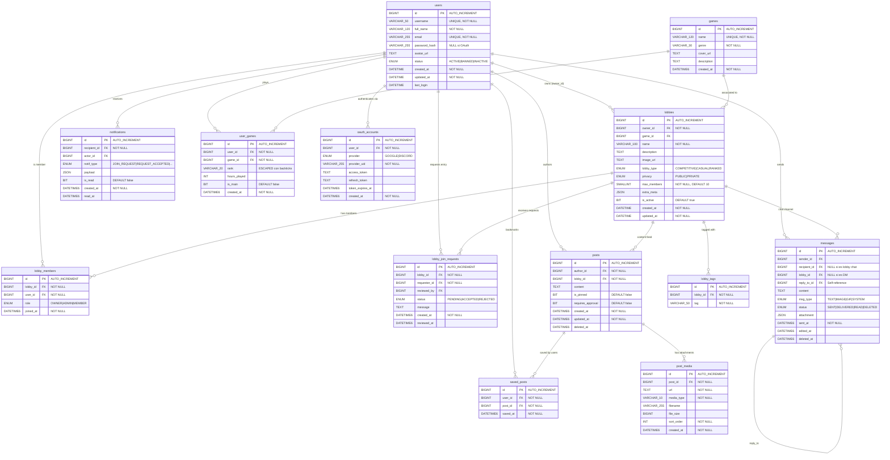

# 2. Esquema de Base de Datos

## 2.1 Motor y Configuración

| Propiedad              | Valor                                      |
|------------------------|--------------------------------------------|
| Motor                  | MySQL 8.0+                                 |
| Charset                | utf8mb4                                    |
| Collation              | utf8mb4_0900_ai_ci                         |
| Storage Engine         | InnoDB (transaccional, soporte FK)         |
| Normalización          | Tercera Forma Normal (3NF)                 |
| DDL Strategy           | `spring.jpa.hibernate.ddl-auto=update`     |

---

## 2.2 Diagrama Entidad-Relación (ERD)

---

## 2.3 Restricciones de Unicidad (Unique Constraints)

| Tabla               | Constraint Name          | Columnas                   |
|---------------------|--------------------------|----------------------------|
| `users`             | `uq_users_email`         | `email`                    |
| `users`             | `uq_users_username`      | `username`                 |
| `games`             | `uq_games_name`          | `name`                     |
| `user_games`        | `uq_user_games`          | `(user_id, game_id)`       |
| `lobby_members`     | `uq_lobby_members`       | `(lobby_id, user_id)`      |
| `lobby_tags`        | `uq_lobby_tag`           | `(lobby_id, tag)`          |
| `oauth_accounts`    | `uq_oauth_provider_uid`  | `(provider, provider_uid)` |
| `saved_posts`       | `uq_saved_posts`         | `(user_id, post_id)`       |

---

## 2.4 Claves Foráneas (Foreign Keys)

| FK Name              | Tabla Origen          | Columna         | Tabla Destino  |
|----------------------|-----------------------|-----------------|----------------|
| `fk_lobby_owner`     | `lobbies`             | `owner_id`      | `users`        |
| `fk_lobby_game`      | `lobbies`             | `game_id`       | `games`        |
| `fk_member_lobby`    | `lobby_members`       | `lobby_id`      | `lobbies`      |
| `fk_member_user`     | `lobby_members`       | `user_id`       | `users`        |
| `fk_jr_lobby`        | `lobby_join_requests` | `lobby_id`      | `lobbies`      |
| `fk_jr_requester`    | `lobby_join_requests` | `requester_id`  | `users`        |
| `fk_jr_reviewer`     | `lobby_join_requests` | `reviewed_by`   | `users`        |
| `fk_lt_lobby`        | `lobby_tags`          | `lobby_id`      | `lobbies`      |
| `fk_ug_user`         | `user_games`          | `user_id`       | `users`        |
| `fk_ug_game`         | `user_games`          | `game_id`       | `games`        |
| `fk_msg_sender`      | `messages`            | `sender_id`     | `users`        |
| `fk_msg_recipient`   | `messages`            | `recipient_id`  | `users`        |
| `fk_msg_lobby`       | `messages`            | `lobby_id`      | `lobbies`      |
| `fk_msg_reply`       | `messages`            | `reply_to_id`   | `messages`     |
| `fk_notif_recipient` | `notifications`       | `recipient_id`  | `users`        |
| `fk_notif_actor`     | `notifications`       | `actor_id`      | `users`        |
| `fk_post_author`     | `posts`               | `author_id`     | `users`        |
| `fk_post_lobby`      | `posts`               | `lobby_id`      | `lobbies`      |
| `fk_media_post`      | `post_media`          | `post_id`       | `posts`        |
| `fk_oauth_user`      | `oauth_accounts`      | `user_id`       | `users`        |

---

## 2.5 Enumeraciones de Dominio

| Enum Java             | Valores                                                                                               |
|-----------------------|-------------------------------------------------------------------------------------------------------|
| `UserStatus`          | `ACTIVE`, `BANNED`, `INACTIVE`                                                                        |
| `LobbyType`           | `COMPETITIVE`, `CASUAL`, `RANKED`                                                                     |
| `LobbyPrivacy`        | `PUBLIC`, `PRIVATE`                                                                                   |
| `MemberRole`          | `OWNER`, `ADMIN`, `MEMBER`                                                                            |
| `JoinRequestStatus`   | `PENDING`, `ACCEPTED`, `REJECTED`                                                                     |
| `MessageType`         | `TEXT`, `IMAGE`, `GIF`, `SYSTEM`                                                                      |
| `MessageStatus`       | `SENT`, `DELIVERED`, `READ`, `DELETED`                                                                |
| `NotificationType`    | `JOIN_REQUEST`, `REQUEST_ACCEPTED`, `REQUEST_REJECTED`, `USER_LEFT`, `USER_JOINED`, `NEW_MESSAGE`, `IMAGE_SENT`, `MENTION`, `POST_APPROVED`, `LOBBY_DELETED`, `SYSTEM` |
| `OAuthProvider`       | `GOOGLE`, `DISCORD`                                                                                   |

> **Nota técnica:** Todos los Enums se mapean como `@Enumerated(EnumType.STRING)` en las entidades JPA, lo que significa que se almacenan como texto legible en MySQL (no como ordinales numéricos), garantizando que la base de datos sea auto-descriptiva.

---

## 2.6 Decisiones de Normalización (3NF)

1. **`lobby_tags`**: Los tags de lobbies se extrajeron de una columna JSON a una tabla independiente `lobby_tags` con restricción `UNIQUE(lobby_id, tag)`. Esto cumple 1NF (eliminando valores multivaluados) y permite indexación individual sobre los tags.

2. **`rank` en `user_games`**: La columna `rank` es una palabra reservada de MySQL 8. Se resolvió escapándola con backticks en la anotación JPA: `@Column(name = "\`rank\`")`.

3. **`messages` dual-purpose**: Un solo modelo soporta tanto chat grupal (cuando `lobby_id != null`) como mensajes directos (cuando `recipient_id != null`), evitando duplicar tablas.
