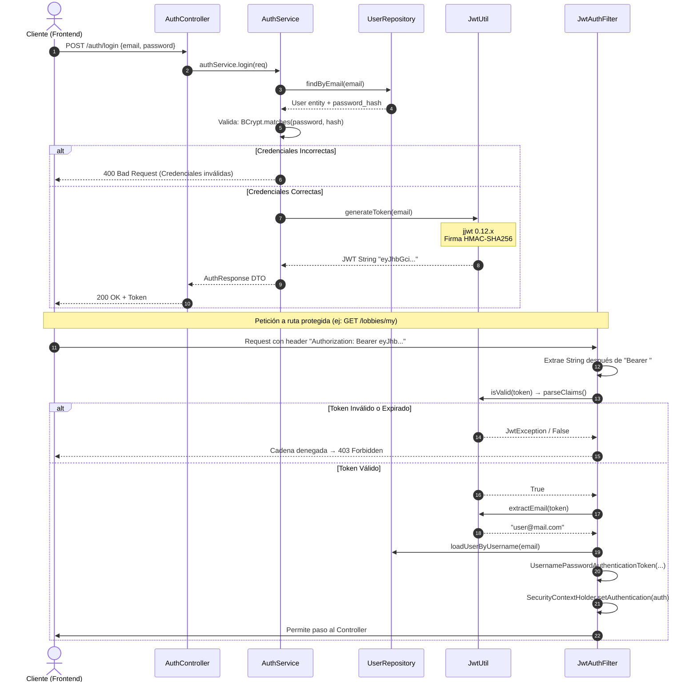
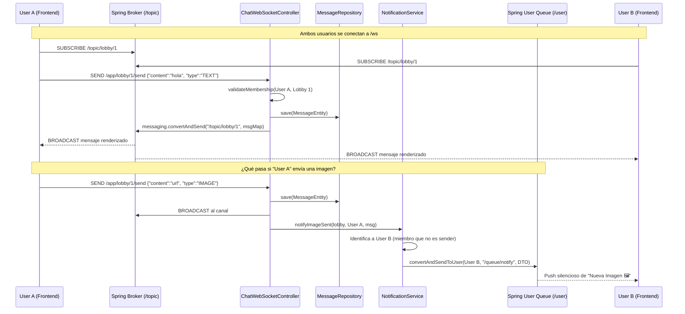

# 4. Seguridad (JWT) y WebSockets (STOMP)

## 4.1 Arquitectura de Seguridad (Spring Security)

El sistema de seguridad de SquadUp es completamente **stateless** (sin sesiones), lo que significa que el servidor no guarda el estado de los usuarios autenticados en memoria. Toda la seguridad está basada en **JSON Web Tokens (JWT)**.

### Configuración de CORS
Dado que el frontend (ej. Angular) y el backend pueden correr en dominios distintos, `SecurityConfig.java` implementa un filtro CORS robusto que procesa dinámicamente orígenes configurados en application properties (`app.cors.allowed-origins`).
- Expone explicitamente los headers requeridos, notablemente `Authorization`.

### Encriptación de Contraseñas
Se utiliza el algoritmo **BCrypt** de una vía (Hash) con nivel de fortaleza (strength) de 12 para almacenar los `password_hash` en BD.

---

## 4.2 Flujo Profundo de Autenticación JWT

### Detalles de Implementación de JWT (`jjwt 0.12.x`)
- Se inyecta la clave secreta `app.jwt.secret` y se inicializa mediante `Keys.hmacShaKeyFor()`.
- El payload solo transporta el campo estandarizado `subject` que apuntamos al correo electrónico. Toda la carga pesada de roles se carga del lado del servidor tras la validación de la firma en cada petición.

---

## 4.3 WebSockets: Comunicación Asíncrona (STOMP)

Para cumplir con la hiperactividad de un LFG, el proyecto expone un servidor WebSocket envolvente bajo el subprotocolo STOMP (Simple Text Oriented Messaging Protocol).

### Setup del EndPoint (`WebSocketConfig.java`)
- **Punto de Conexión:** `/ws`
- **Fallback:** Soporte nativo de `SockJS` por el cliente en navegadores donde no se soporta WS de forma prístina.
- **Canales de envío cliente-servidor:** Prefijo `/app` (ej. `/app/lobby/1/send`).
- **Brokers de retransmisión servidor-cliente:**
    - `/topic` para difusión pública o 1:N (un mensaje a todo un grupo).
    - `/user` para difusión privada 1:1 o eventos push exclusivos.

---

## 4.4 Flujo STOMP: Chat de Lobby y Notificaciones

Cuando dos usuarios están en el mismo lobby (Id `1`), la plataforma coordina los mensajes en tiempo real.

### Mensajes Directos (DM)
También se soporta chat 1 a 1 mediante este mismo protocolo.
- Ruta de envío: `/app/dm/{recipientId}/send`.
- El Broker no lo manda a un public topic, sino a una queue privada interceptada en tiempo real mediante `convertAndSendToUser(recipientId, "/queue/dm", payload)`.

### Eventos Push Globales (Campanita)
Cualquier clase en Spring puede inyectar el componente `NotificationService`. Cuando ocurre un evento relacional que demanda la atención subita de otro jugador (por ejemplo en `LobbyService.reviewJoinRequest`), el servidor inmediatamente lo empuja por socket enviándolo a la ruta `/user/{id}/queue/notify`.
